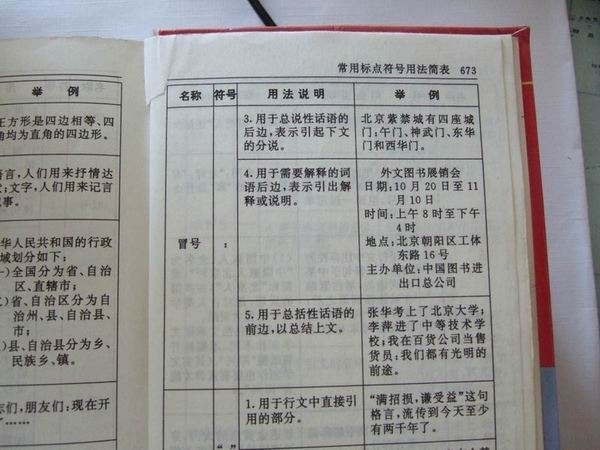

张华考上了北京大学;李萍进了中等技术学校;我在百货公司当售货员。我们都有光明的前途----1998

　　四年后，张华北大毕业去了证券，我说你干嘛的？他说我每天看K线图呢，k线图，是什么啊？他说，你真怂　
　　我再看看李萍，她已经毕业一年了，在玻璃厂做工人，每天骑着自行车上班，看完人民日报后开始悠然自得地戳机床，她看着我，总是说：“当工人好啊,加强政治修养。”　
　　看着百货公司隔壁红火的超市，看着我一天天干瘪的裤兜子，咬咬牙，我有了决议。　
　　四年后，张华当上了证券公司经理，整天穿得西装革履，夹着公文包开着奔驰流窜在银行和企业，开口上市闭口牛市。我当上了隔壁超市的采购部经理，整天和一些供应商泡在酒杯里偶尔洗洗桑拿放松一下
<!-- more -->
　　李萍呢，据说她们玻璃厂倒闭了，据说他们厂长那厂里的钱委托证券公司去投资，结果。。。，其实我不知道跟我也有没有关系，超市这两年大量采购了很多装葡萄酒的很炫的高脚杯，和装可口可乐很靓的曲线杯，听说他们的玻璃卖不出去了，李萍下岗了，有时候看到她在城北卖报纸，她总是吆喝：“先生，要报纸不，人民日报头条！"别人摇摇头，她再一扯别人：“诶，还有知音，南方周末，体坛周刊，楚天都市报，人之初。”“给我一份人之初和楚天都市报。”-----旁边窜出一个中学生喊道，李萍遥遥头，还是都卖给他了。
　　其实我有个秘密只告诉过李萍，我跳槽到超市的时候，把原来百货公司的供应商都拉去了超市，没办法，我要养孩子，，，
　　四年后，原来的百货公司也快破产了，不过我又回来了，给他们拉来了更多的客户和供应商，我不知道我能把这个烂摊子撑多久，但没关系，百货公司任命我为党委副书记了。
　　张华人模人样，据说都包情妇了，在电视上和银行企业之间流窜，据说还是某某大学金融系客座教授，他的情妇，据说是一个大学生，我看过，很嫩，很卡哇伊，很。。。。会花钱。张华养得起，钱么，银行卡里面不都是！　
　　李萍消失了，，，，，，
　　四年后，百货公司彻底破产了，不过我已经调到财政局当了副局长，每天端着酒杯，和一群很久以前是大学生的官员一起出国考察，吃喝玩乐，我觉得和在超市当采购经理的时候比，只不过周围的人更加会伪装了，前天在高级桑拿捏过脚，第二天就可以在大会上大声宣言：“我们都是公仆！人民就是养我们的，GCD员处事为人要立得住脚！"多厉害，我的脚都在哆嗦呢。张华混到银行当副行长了，口气还是那么大，不过换了一个更加嫩的女大学生，扭在他身上喝酒嗲着撒娇。我和张华吃饭，“呵呵，局长大人啊，见笑见笑！来，宝贝，给局长敬杯酒！。”--张华说道。我喝了，虽然我觉得那个妞的香水味太刺鼻。改变的是，张华现在对我很恭敬，想当初是不曾有的。
　　李萍呢，据说她愤而通过了自考又复习考研，考到了北大去了。。。她说，没知识被欺负。是吗？有知识又能怎么样。
　　四年后，纪委的人找我，我顿时凉了，原来局长的事情弄大了，他们贪污的钱都被发现了，我知道我没地方去只能乖乖就范了。因为有上面的人暗示过我，局长是犯事了，可局长的后台深不可测，让我去扛了，妻儿老小绝对给我照顾地好好的，进去顶多呆一两年再想办法保到别的地方去给弄出来，如果我犟，那么不光把一切推到我头上，而且要让我一直扛下去。咬咬牙，我答应了。　
　　张华也倒了，他玩票玩大了，还弄了两个女明星，媒体曝光过多，不知道他将被带到哪儿去，有人保他否　
　　李萍呢，北大哲学硕士毕业，研究老子和佛经。　
　　四年后，李萍担任了北大哲学系讲师，据说课讲得非常好，也不参加各类活动。我呢，在外地的一个中等职业技术学校教营销，答应了保我的人自己也倒了，结果我只完成了第一步，却没有人帮我继续保到校长然后保到政协，我也觉得老了，忽而没了力气，不想再往上爬，看到教导主任和校长他们，我都不想理会。一天校长拦住我说，你好像是**省**市的吧，好好教书，不要无精打采，想当年我们学校还有学生考进北大哲学硕士呢，好像是你那个地方出来的。　
　　 张华呢，从以前的副行长被降级到另一家银行了，可能永远也得不到提拔了，据说，这个银行的前身是供销社，也就是后来的百货公司。
　　结果，李萍在北大，我在中等职业技术学校，张华在供销社的后身，我们都有光明的前途。
　　我去北大听过李萍的课，她讲到，诸行无常、诸法无我、涅磐寂静 ，我现在才懂了，咬咬牙，我要做的，不过是，好好拿工资，不要耽误了孩子，然后老去。我已经40多岁啦！

河南的张华考上了北京大学，毕业月薪15K，贷款30年，买房在房山；
上海的李萍进了中等技术学校，家里棚改5套回迁；
广东的我初中辍学在自家百货商场当售货员；
我们都有光明的未来……

张华拿了奖学金去美国读生物学博士，李萍考上了某985大学的计算机系本科，而我虽然三本毕业但有关系，去了市政府办公室服务领导一天端茶倒水，虽然技术含量不高，但近水楼台，每天找我介绍关系、打听消息的人很多。
我们都有光明的前途。

张华考进了名牌大学，李萍在当电业局局长父亲的指点下去了行业内的电力专科学校，而我开始学习替家族管理一个小企业，我们都有光明的前途

张华考上了北京大学夜大函授班；李萍进了中等技术学校当校长；我在地产公司当销售员
这么说你是不是就觉得平衡了？

我考上了北大，四年后我就是中央干部，前途无量
你考上了职业学校，几年后进垄断央企，很快升处级干部。
她在阿里当小二，三年一套杭州市中心大房

我们都有光明的前途
张华的父亲是北京大学中文系系主任，李萍是中专校长的女儿，“我”的父亲后来开了房地产公司，我们都有光明的前途。
现在是，博士满街走，硕士不如狗
张华有个好爸爸，李萍可以靠脸吃饭，还好我家房子要拆迁了
一个国家巨头，一个地区巨头，一个本地巨头……你说光明不光明？

工作无贵贱，劳动光荣！
掏粪工人能让国家主席学习！
售票员可以是全国三八红旗手！
洗脚妹可以是全国人大代表！
生产线上打螺钉的大妈可以是波音公司终身员工！
如果你看不懂说明你还小。
张华花钱进了个计算机培训班，李萍大学选择了金融相关专业，我在淘宝开了个小店，我们的前途都很光明

我想起了一个我记了十年的一句话，小学毕业时时候我们校长说的你们以后有的人初中毕业参加工作，有的人高中毕业参加工作，有的人大学，研究生，甚至是博士，但是不管你走多远，只要你对社会做贡献，社会需要你，你这个人就是 有价值的，就会有人记得你。大概就是这个意思，我毕业了这么久，听过无数次演讲，但是小学毕业时候校长的话让我一直记着，很简单的话，却让那时候我那个小屁孩一直记着，其实说那么多干嘛，只要人有人牵挂着，被人铭记着，我认为未来都是光明的。

张华考上了985大学；李萍进了某垄断国企的干部培训班；我在本地最大的超市当物流副主管：我们都有光明的前途。

那个年代，大学生、技工、超市售货员相当于今天金融、IT、公务员。
你把前三个放今天试试？