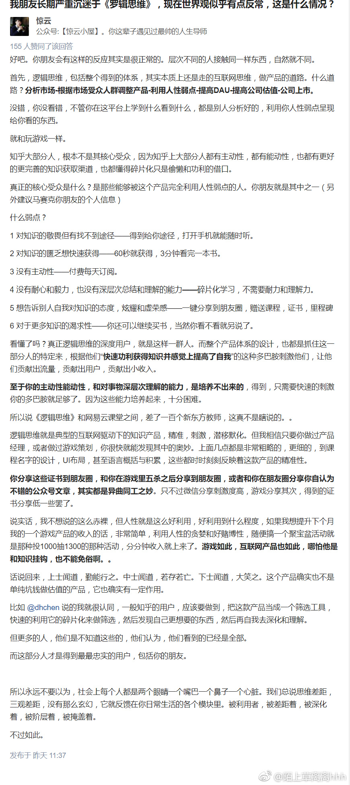

有时候吧，卧薪尝胆，也是一种鸦片
在你卧薪尝胆之前，你一定要思考清楚，自己为了什么而卧薪尝胆。
只知道卧薪尝胆   然后自我安慰，却从来不想自己为什么卧薪为什么尝胆
卧薪尝胆，精神可嘉，但有时自己感动自己，如果学习方法不对，也事倍功半。
有时候，自己只是假装很努力，其实并没有什么用
他发现了知识的伟大，但是大大低估了获取知识的难度。

他提出的问题都没错，但是要回答那些问题，可能要花费数十年，而不是他以为的那样，只要囫囵吞枣的看几本书就行了。等他明白这一点了，就不会这样自大了。
https://www.zhihu.com/question/66110170

