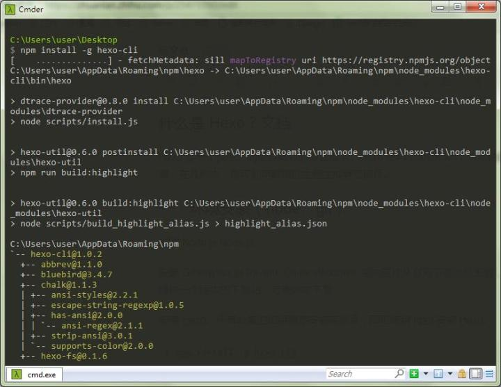

使用 hexo+Github搭建博客

什么是 Hexo？文档
Hexo 是一个快速、简洁且高效的博客框架。Hexo 使用 Markdown（或其他渲染引擎）解析文章，在几秒内，即可利用靓丽的主题生成静态网页。


一、配置 Github
首先注册、登录 (github)[https://github.com/]
记住自己的 Username（很重要）
然后右上角选择 Create a new repository [https://github.com/new](https://github.com/new)
Repository name 填自己的名字 http://yourname.github.io
与你的注册用户名一致, 这个就是你博客的域名了)

例如，我的域名是 http://github.com/yawuplus，
就填入 http://yawuplus.github.io。
成功后出现下面的画面

二、环境安装（node、git）
安装  [Node.js](https://nodejs.org/en/)
安装 Git [Git for Windows.](https://git-scm.com/downloads)

国内直接从官网下载比较困难，需要翻墙。这里提供一个国内的下载站，方便网友下载
[Git 教程](https://www.liaoxuefeng.com/wiki/0013739516305929606dd18361248578c67b8067c8c017b000/)这里有廖雪峰老师的教程，非常好。

安装完成后，在开始菜单里找到 “Git”->“Git Bash”，名称和邮箱是 Github 上的

安装 Hexo。所有必备的应用程序安装完成后，即可使用 npm 安装 Hexo。
```bash
$ npm install -g hexo-cli
```


三、设置
在电脑 D 盘（看自己）目录下新建文件夹 test，进入 test，按住 Shift 键点击鼠标右键

因为我有安装 Cmder，没有安装的点击 “在此处打开命令窗口”，输入
```bash
hexo init blog
```
稍微等待下，速度有点慢。成功提示
INFO  Start blogging with Hexo!
 因为你初始化hexo 之后source目录下自带一篇hello world文章, 所以直接执行下方命令
```bash
$ hexo generate
# 启动本地服务器
$ hexo server
# 在浏览器输入 http://localhost:4000/就可以看见网页和模板了
INFO  Start processing
INFO  Hexo is running at http://localhost:4000/. Press Ctrl+C to stop.
访问 http://localhost:4000/，便可以看到网站初步的模样，不要激动，我们还要把网页发布到 Github 上去。
```
重新打开 CMD，输入：
```bash
ssh-keygen -t rsa -C "Github的注册邮箱地址"
```
一路 Enter 过来就好，得到信息：
```bash
Your public key has been saved in /c/Users/user/.ssh/id_rsa.pub.
找到该文件，打开（sublime text），Ctrl + a 复制里面的所有内容，然后进入 Sign in to GitHub：
```
New SSH key ——Title：blog —— Key：输入刚才复制的—— Add SSH key
四、配置博客
在 blog 目录下，用 sublime 打开_config.yml 文件，修改参数信息
```bash
# Hexo Configuration
## Docs: http://hexo.io/docs/configuration.html
## Source: https://github.com/hexojs/hexo/
# Site #站点信息
title:  #标题
subtitle:  #副标题
description:  #站点描述，给搜索引擎看的
author:  #作者
email:  #电子邮箱
language: zh-CN #语言
# URL #链接格式
url:  #网址
root: / #根目录
permalink: :year/:month/:day/:title/ #文章的链接格式
tag_dir: tags #标签目录
archive_dir: archives #存档目录
category_dir: categories #分类目录
code_dir: downloads/code
permalink_defaults:
# Directory #目录
source_dir: source #源文件目录
public_dir: public #生成的网页文件目录
# Writing #写作
new_post_name: :title.md #新文章标题
default_layout: post #默认的模板，包括 post、page、photo、draft（文章、页面、照片、草稿）
titlecase: false #标题转换成大写
external_link: true #在新选项卡中打开连接
filename_case: 0
render_drafts: false
post_asset_folder: false
relative_link: false
highlight: #语法高亮
  enable: true #是否启用
  line_number: true #显示行号
  tab_replace:
# Category & Tag #分类和标签
default_category: uncategorized #默认分类
category_map:
tag_map:
# Archives
2: 开启分页
1: 禁用分页
0: 全部禁用
archive: 2
category: 2
tag: 2
# Server #本地服务器
port: 4000 #端口号
server_ip: localhost #IP 地址
logger: false
logger_format: dev
# Date / Time format #日期时间格式
date_format: YYYY-MM-DD #参考http://momentjs.com/docs/#/displaying/format/
time_format: H:mm:ss
# Pagination #分页
per_page: 10 #每页文章数，设置成 0 禁用分页
pagination_dir: page
# Disqus #Disqus评论，替换为多说
disqus_shortname:
# Extensions #拓展插件
theme: landscape-plus #主题
exclude_generator:
plugins: #插件，例如生成 RSS 和站点地图的
- hexo-generator-feed
- hexo-generator-sitemap
# Deployment #部署，将 lmintlcx 改成用户名
deploy:
  type: git
  repo: 刚刚github创库地址.git
  branch: master
```
特别提醒，在每个参数的：后都要加一个空格
修改网站相关信息
```bash
title: 瞻彼淇奥测试所用博客
subtitle: 副标题
description: 网页描述
author: 瞻彼淇奥
language: zh-CN
timezone: Asia/Shanghai
配置部署（我的是 yawuplus，修改成自己的）

deploy: 
  type: git
  repo: https://github.com/yawuplus/yawu.github.io.git
  branch: master
```
五、发表文章
在 CMD 中输入
```bash
$ hexo new "瞻彼淇奥测试文章"
INFO  Created: F:\test\blog\source\_posts\瞻彼淇奥测试文章.md
```
找到该文章，打开，使用 Markdown 语法，该语法介绍可以查看利用 HEXO 搭建的博客及 Markdown 语法介绍
```bash
---
title: 瞻彼淇奥测试文章
date: 2017-02-28 13:03:44
tags:
---
这是一篇测试文章，欢迎关注作者博客[1]: https://yawuplus.github.io/
保存，然后执行下列步骤：

F:\test\blog
$ hexo clean
INFO  Deleted database.
INFO  Deleted public folder.

F:\test\blog
$ hexo generate
INFO  Start processing
INFO  Files loaded in 1.48 s
#省略
INFO  29 files generated in 4.27 s

F:\test\blog
$ hexo server
INFO  Start processing
INFO  Hexo is running at http://localhost:4000/. Press Ctrl+C to stop.
```
这个时候，打开 http://localhost:4000/
发现刚才的文章已经成功了

最后一步，发布到网上，执行：
F:\test\blog

```bash
$ hexo deploy
INFO  Deploying: git
INFO  Clearing .deploy_git folder...
INFO  Copying files from public folder...
#省略
```
其中会跳出 Github 登录，直接登录，如果没有问题输入 yawuplus（换成你的）http://yawuplus.github.io/

然后就可以看到已经发布了

六、总结
发布文章的步骤：
```bash
1、hexo new 创建文章
2、Markdown 语法编辑文章
3、部署（所有打开 CMD 都是在 blog 目录下）
hexo clean #清除缓存 网页正常情况下可以忽略此条命令
hexo generate #生成
hexo server #启动服务预览，非必要，可本地浏览网页
hexo deploy #部署发布
简写 Tips：
hexo n "我的博客" == hexo new "我的博客" #新建文章
hexo p == hexo publish
hexo g == hexo generate# 生成
hexo s == hexo server #启动服务预览
hexo d == hexo deploy# 部署
```
如果在执行 hexo deploy 后, 出现 error deployer not found:github 的错误，执行：
npm install hexo-deployer-git --save
出错是正常的，出错了自己先百度或 google，实在不知道的可以询问我。

托管的话不仅有 github 可以用，还有个国内的 http://coding.net 可选
------------------------------------------------------------------------------------------------------------------------------------------------------------------------------------------------------------------------------------------------------
到这里已经完成了博客的搭建，但是还有很多需要设置和调整的。这是我的博客，也许你会发现，我和刚才搭建的不一样，因为我修改了博客主题，简洁、优美。
主题介绍 litten/hexo-theme-yilia: 一个简洁优雅的 hexo 主题 A simple and elegant theme for hexo.

========================== 分割线 =======================================
NexT 主题 开始使用 - NexT 使用文档
可以增加评论和阅读量 (亲，根据官方文档配置）
评论有 [多说](http://duoshuo.com/)，计数有 [](http://ibruce.info/2015/04/04/busuanzi/)
点击查看,效果如下：
[瞻彼淇奥的博客](https://yawujia.cn/)


