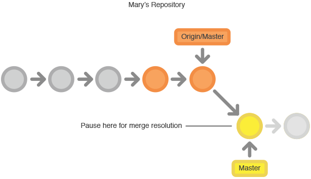

github以前用来搭建过博客，但是不会用git仓库，最近抽时间跳坑，把常见问题总结了下。
### 配置 Github

首先注册、登录 (github)[https://github.com/]
记住自己的 Username（很重要）
然后右上角选择 Create a new repository [https://github.com/new](https://github.com/new)

+ 环境安装（git）
安装 Git [Git for Windows.](https://git-scm.com/downloads)


国内直接从官网下载比较困难，需要翻墙。这里提供一个国内的下载站，方便网友下载
[Git 教程](https://www.liaoxuefeng.com/wiki/0013739516305929606dd18361248578c67b8067c8c017b000/)这里有廖雪峰老师的教程，非常好。
初次使用安装
linux 
`sudo apt-get install git`
windows下直接出了点默认
<!-- more -->
+ ### 配置账号

 你的用户名
`git config --global user.name   "yawuplus"`
你的邮箱名
`git config --global user.email    "1397991131@qq.com"`

生成ssh keys

`ssh-keygen -t rsa -C     "1397991131@qq.com"`

一路 Enter 过来就好，得到信息：

Your public key has been saved in /c/Users/user/.ssh/id_rsa.pub.
找到该文件，打开（sublime text），Ctrl + a 复制里面的所有内容，然后进入 Sign in to GitHub：

New SSH key ——ssh(这个ssh为你的ssh keys的名字，你可以根据自己需要起名字)：
git —— Key：输入刚才复制的—— Add SSH key
在git bash 输入
`ssh -T git@github.com`

如果输出下面的(yawuplus是我的用户名，你配置时候这里应该显示的是你的用户名)

Hi yawuplus! You've successfully authenticated, but GitHub does not provide shell access.

就说明你的git已经配置成功了。

### 一台电脑配置多个git账号

因为工作需要，因此个人电脑上需要配置两个git账号，一个自己的github，一个公司的gitlab

步骤如下:

先生成 对应账号的ssh keys

`ssh-keygen -t rsa -C     "1397991131@qq.com"`

这里不要着急按回车键，把ssh keys改名，比如 id_rsa, id_rsa_work

取消之前全局配置的git username email

`git config --global --unset user.name` 

`git config --global --unset user.email` 

把对应账号生成的ssh keys添加到你的github、gitlab账号里

然后,生成完密钥之后，我们还需要使用 `ssh-add` 命令是把专用密钥添加到 `ssh-agent` 的高速缓存中

ssh-**add** -K ~/.ssh/id_rsa_work

如果出现Could not open a connection to your authentication agent的错误，记得先执行

**ssh-agent bash**

然后在执行上面的添加命令。

执行完成后，在Users/.ssh/目录下，新建config文件


文件内容如下:

# 该文件用于配置私钥对应的服务器
`Host git@github.com   
    HostName https://github.com`
    `User yawuplus`
    `IdentityFile ~/.ssh/id_rsa_yawuplus`    

# 你第二个账号(公司gitlab账号)的host和主机地址，用户名，端口号等信息.

`Host gitlab.zhichiwangluo.com`
    `HostName gitlab.zhichiwangluo.com`
    `Port 12345`
    `User jiayawu`
    `IdentityFile ~/.ssh/id_rsa_work`

这些配置完，基本上就可以了，不过要注意的是，因为之前你用unset取消了全局的email name设置，因此，在你每个项目的repo下，可以使用

`git config --local  user.name  jiayawu`

`git config --local user.email  “3013568147@qq.com”`

这样的方式来设置对应repo的 name email。

遇到出现没有权限时候，执行以下命令

`$ ssh-agent bash`

`jia@DESKTOP-0FM6II9 MINGW64 /d/codes/Lianjia (master)`
`$ ssh-add ~/.ssh/id_rsa_github`
`Identity added: /c/Users/13979/.ssh/id_rsa_github (“1397991131@qq.com“)`

`jia@DESKTOP-0FM6II9 MINGW64 /d/codes/Lianjia (master)`
`$ git config user.email "1397991131@qq.com"`

`jia@DESKTOP-0FM6II9 MINGW64 /d/codes/Lianjia (master)`
`$ git config user.name "yawuplus"`

git 常用命令


```bash
bash 
初始化仓库
git init
检查状态
git status
将文件加入仓库
git add .
执行提交
git commit -m "start project."
查看提交历史
git log
删除仓库
rm -rf .git
将本地更改推送到远程master分支
git push origin master
创建本地仓库到提交
git init
关联仓库
 git remote add origin git@github.com:yawuplus/Data_Structures-in-C.git
提交时候把上面的仓库换成你自己的repository地址
添加文件
git add .
推送到本地暂存区
git commit -m "提交说明"
git pull --rebase origin master
将本地代码同步到远程仓库，这样你就完成了向远程仓库的推送。
git push origin master
强制push到远程仓库
git push -u origin master -f
从远程仓库clone到本地
 git clone git@github.com:yawuplus/Data_Structures-in-C.git
如果在github的remote上已经有了文件，会出现错误。此时应当先pull一下，即：
git pull origin master
然后再进行：
git push origin master
查看本地仓库状态
git status

```
    把本地库的内容推送到远程，用gitpush命令，实际上是把当前分支master推送到远程
由于远程库是空的，我们第一次推送master分支时，加上了-u参数，Git不但会把本地的master分支内容推送的远程新的master分支，还会把本地的master分支和远程的master分支关联起来，在以后的推送或者拉取时就可以简化命令
推送成功后，可以立刻在GitHub页面中看到远程库的内容已经和本地一模一样：
场景1：当你改乱了工作区某个文件的内容，想直接丢弃工作区的修改时，用命令git checkout -- file。
场景2：当你不但改乱了工作区某个文件的内容，还添加到了暂存区时，想丢弃修改，分两步，第一步用命令git reset HEAD file，就回到了场景1，第二步按场景1操作。
场景3：已经提交了不合适的修改到版本库时，想要撤销本次提交，参考版本回退一节，不过前提是没有推送到远程库。
常见问题
Updates were rejected because the tip of your current branch is behind
有如下几种解决方法：
1.使用强制push的方法：
$ git push -u origin master -f
这样会使远程修改丢失，一般是不可取的，尤其是多人协作开发的时候。

2.push前先将远程repository修改pull下来
$ git pull origin master
$ git push -u origin master
3.若不想merge远程和本地修改，可以先创建新的分支：
$ git branch [name]
然后push

开发者开始先克隆中央仓库。在自己的项目拷贝中，像SVN一样的编辑文件和提交修改；但修改是存在本地的，和中央仓库是完全隔离的。开发者可以把和上游的同步延后到一个方便时间点。
要发布修改到正式项目中，开发者要把本地master分支的修改『推（push）』到中央仓库中。这相当于svn commit操作，但push操作会把所有还不在中央仓库的本地提交都推上去。
git-workflow-svn-push-local
冲突解决
中央仓库代表了正式项目，所以提交历史应该被尊重且是稳定不变的。如果开发者本地的提交历史和中央仓库有分歧，Git会拒绝push提交否则会覆盖已经在中央库的正式提交。
git-workflow-svn-managingconflicts
在开发者提交自己功能修改到中央库前，需要先fetch在中央库的新增提交，rebase自己提交到中央库提交历史之上。这样做的意思是在说，『我要把自己的修改加到别人已经完成的修改上。』最终的结果是一个完美的线性历史，就像以前的SVN的工作流中一样。
如果本地修改和上游提交有冲突，Git会暂停rebase过程，给你手动解决冲突的机会。Git解决合并冲突，用和生成提交一样的git status和git add命令，很一致方便。还有一点，如果解决冲突时遇到麻烦，Git可以很简单中止整个rebase操作，重来一次（或者让别人来帮助解决）。
Github使用步骤
工作方式
像Subversion一样，集中式工作流以中央仓库作为项目所有修改的单点实体。相比SVN缺省的开发分支trunk，Git叫做master，所有修改提交到这个分支上。该工作流只用到master这一个分支。
开发者开始先克隆中央仓库。在自己的项目拷贝中，像SVN一样的编辑文件和提交修改；但修改是存在本地的，和中央仓库是完全隔离的。开发者可以把和上游的同步延后到一个方便时间点。
要发布修改到正式项目中，开发者要把本地master分支的修改『推（push）』到中央仓库中。这相当于svn commit操作，但push操作会把所有还不在中央仓库的本地提交都推上去。

git-workflow-svn-push-local

冲突解决
中央仓库代表了正式项目，所以提交历史应该被尊重且是稳定不变的。如果开发者本地的提交历史和中央仓库有分歧，Git会拒绝push提交否则会覆盖已经在中央库的正式提交。

git-workflow-svn-managingconflicts

在开发者提交自己功能修改到中央库前，需要先fetch在中央库的新增提交，rebase自己提交到中央库提交历史之上。这样做的意思是在说，『我要把自己的修改加到别人已经完成的修改上。』最终的结果是一个完美的线性历史，就像以前的SVN的工作流中一样。

如果本地修改和上游提交有冲突，Git会暂停rebase过程，给你手动解决冲突的机会。Git解决合并冲突，用和生成提交一样的git status和git add命令，很一致方便。还有一点，如果解决冲突时遇到麻烦，Git可以很简单中止整个rebase操作，重来一次（或者让别人来帮助解决）。

示例

让我们一起逐步分解来看看一个常见的小团队如何用这个工作流来协作的。有两个开发者小明和小红，看他们是如何开发自己的功能并提交到中央仓库上的。

有人先初始化好中央仓库

第一步，有人在服务器上创建好中央仓库。如果是新项目，你可以初始化一个空仓库；否则你要导入已有的Git或SVN仓库。
中央仓库应该是个裸仓库（bare repository），即没有工作目录（working directory）的仓库。可以用下面的命令创建：
ssh user@host
git init --bare /path/to/repo.git
确保写上有效的user（SSH的用户名），host（服务器的域名或IP地址），/path/to/repo.git（你想存放仓库的位置）。注意，为了表示是一个裸仓库，按照约定加上.git扩展名到仓库名上。
所有人克隆中央仓库

下一步，各个开发者创建整个项目的本地拷贝。通过git clone命令完成：
git clone ssh://user@host/path/to/repo.git
基于你后续会持续和克隆的仓库做交互的假设，克隆仓库时Git会自动添加远程别名origin指回『父』仓库。
小明开发功能

在小明的本地仓库中，他使用标准的Git过程开发功能：编辑、暂存（Stage）和提交。如果你不熟悉暂存区（Staging Area），这里说明一下：暂存区的用来准备一个提交，但可以不用把工作目录中所有的修改内容都包含进来。这样你可以创建一个高度聚焦的提交，尽管你本地修改很多内容。
git status # 查看本地仓库的修改状态
git add # 暂存文件
git commit # 提交文件
请记住，因为这些命令生成的是本地提交，小明可以按自己需求反复操作多次，而不用担心中央仓库上有了什么操作。对需要多个更简单更原子分块的大功能，这个做法是很有用的。
小红开发功能

与此同时，小红在自己的本地仓库中用相同的编辑、暂存和提交过程开发功能。和小明一样，她也不关心中央仓库有没有新提交；当然更不关心小明在他的本地仓库中的操作，因为所有本地仓库都是私有的。
小明发布功能

一旦小明完成了他的功能开发，会发布他的本地提交到中央仓库中，这样其它团队成员可以看到他的修改。他可以用下面的git push命令：

git push origin master

注意，origin是在小明克隆仓库时Git创建的远程中央仓库别名。master参数告诉Git推送的分支。由于中央仓库自从小明克隆以来还没有被更新过，所以push操作不会有冲突，成功完成。
小红试着发布功能

一起来看看在小明发布修改后，小红push修改会怎么样？她使用完全一样的push命令：

git push origin master

但她的本地历史已经和中央仓库有分岐了，Git拒绝操作并给出下面很长的出错消息：
error: failed to push some refs to '/path/to/repo.git'
hint: Updates were rejected because the tip of your current branch is behind
hint: its remote counterpart. Merge the remote changes (e.g. 'git pull')
hint: before pushing again.
hint: See the 'Note about fast-forwards' in 'git push --help' for details.
这避免了小红覆写正式的提交。她要先pull小明的更新到她的本地仓库合并上她的本地修改后，再重试。
小红在小明的提交之上rebase

小红用git pull合并上游的修改到自己的仓库中。这条命令类似svn update——拉取所有上游提交命令到小红的本地仓库，并尝试和她的本地修改合并：

git pull --rebase origin master

--rebase选项告诉Git把小红的提交移到同步了中央仓库修改后的master分支的顶部，如下图所示：

如果你忘加了这个选项，pull操作仍然可以完成，但每次pull操作要同步中央仓库中别人修改时，提交历史会以一个多余的『合并提交』结尾。对于集中式工作流，最好是使用rebase而不是生成一个合并提交。
小红解决合并冲突


rebase操作过程是把本地提交一次一个地迁移到更新了的中央仓库master分支之上。这意味着可能要解决在迁移某个提交时出现的合并冲突，而不是解决包含了所有提交的大型合并时所出现的冲突。这样的方式让你尽可能保持每个提交的聚焦和项目历史的整洁。反过来，简化了哪里引入Bug的分析，如果有必要，回滚修改也可以做到对项目影响最小。

如果小红和小明的功能是相关的，不大可能在rebase过程中有冲突。如果有，Git在合并有冲突的提交处暂停rebase过程，输出下面的信息并带上相关的指令：

CONFLICT (content): Merge conflict in

Git很赞的一点是，任何人可以解决他自己的冲突。在这个例子中，小红可以简单的运行git status命令来查看哪里有问题。冲突文件列在Unmerged paths（未合并路径）一节中：
Shell
```bash# Unmerged paths:
# (use "git reset HEAD <some-file>..." to unstage)
# (use "git add/rm <some-file>..." as appropriate to mark resolution)
#
# both modified: <some-file>
# Unmerged paths:
# (use "git reset HEAD <some-file>..." to unstage)
# (use "git add/rm <some-file>..." as appropriate to mark resolution)
#
# both modified: <some-file>
```
接着小红编辑这些文件。修改完成后，用老套路暂存这些文件，并让git rebase完成剩下的事：
git add
git rebase --continue
要做的就这些了。Git会继续一个一个地合并后面的提交，如其它的提交有冲突就重复这个过程。
如果你碰到了冲突，但发现搞不定，不要惊慌。只要执行下面这条命令，就可以回到你执行git pull --rebase命令前的样子：
git rebase --abort
小红成功发布功能


小红完成和中央仓库的同步后，就能成功发布她的修改了：
git push origin master

## problems:
Your branch and 'origin/master' have diverged,
solution:
因为开发环境有区别，同事和我安装的包也有区别，不小心把他的apache4php这个包删除了，后面线上支付出了问题，后面就有点混乱了，然后今早拉取最新代码的时候就出现如题那个错误，说我的本地和远程分叉了，我本地还比远程多4个commit，本想把远程的拉下来然后手动解决冲突的，发现一拉就报错，

$ git status
On branch master
Your branch and 'origin/master' have diverged,
and have 3 and 4 different commits each, respectively.
  (use "git pull" to merge the remote branch into yours)
nothing to commit, working tree clean
根据提示说把远程拉下来和我本地合并，完全不管用。没办法，只能用远程覆盖本地的了，命令如下
注意了，这个操作会覆盖本地的修改，因此建议手动备份！一定要备份！可以查看一下本地和远程现在有区别的有哪些文件，针对性的备份。
git fetch origin
git reset --hard origin/master
https://blog.csdn.net/zhezhebie/article/details/79130470

参考:
http://blog.csdn.net/shiren1118/article/details/7761203
http://blog.csdn.net/michael10001/article/details/51371715
http://blog.csdn.net/qq_27062249/article/details/56671123
https://stackoverflow.com/questions/25237959/updates-were-rejected-because-the-tip-of-your-current-branch-is-behind-hint-its
http://blog.csdn.net/zhangti123321/article/details/52020980
https://www.liaoxuefeng.com/wiki/0013739516305929606dd18361248578c67b8067c8c017b000/001375233990231ac8cf32ef1b24887a5209f83e01cb94b000


