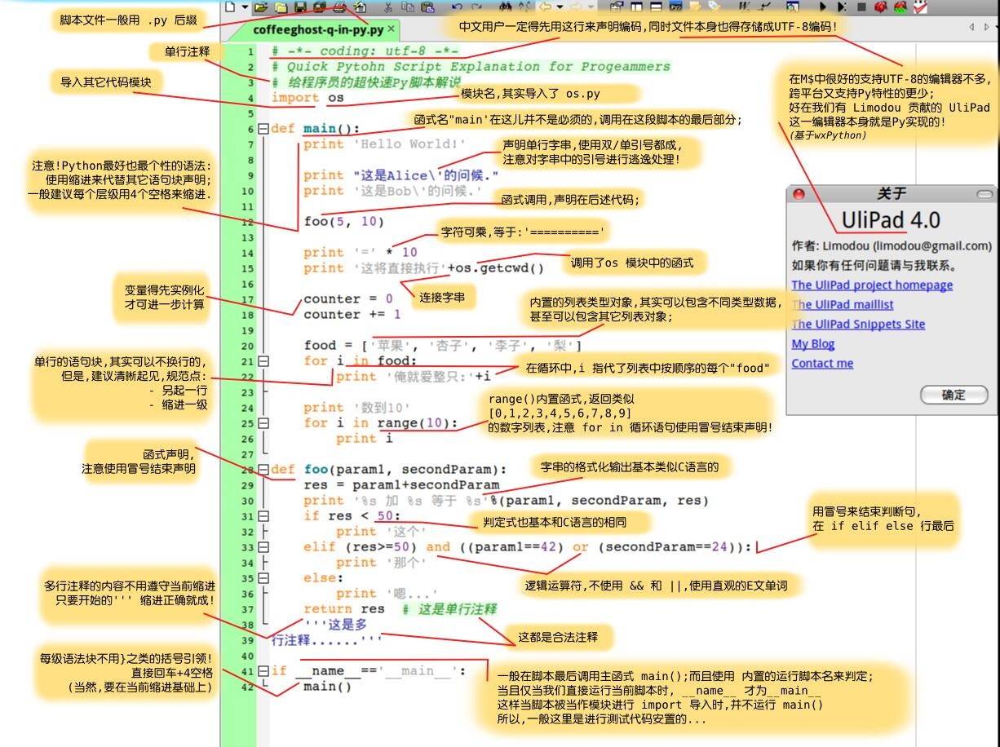

Python是一门面向对象的解释型语言，基本上其他语言能够做的，python由于拥有强大的类库自带轮子，因此都可以做，因此你可以用python开发各种你想要的程序，包括桌面程序，爬虫 ，web开发，科学计算，机器学习，人脸识别等功能。
<!-- more -->
首先我们来看一张图片即可快速入门python:

对于以下所涉及到的所有python类库，如果电脑配置好了python环境后，都可以打开cmd使用:
pip install xxxx
这样的命令安装对应的类库
比如安装django,请输入:
pip install django
学习python，对于零基础python入门的学习者来说，建议看head first python
head first python pdf
http://www.jb51.net/books/86697.html
learn python the hard way
https://learnpythonthehardway.org/book/
对于有编程基础的人来说，建议看python编程，从入门到实践和python核心编程这两本书
python从入门到实践pdf
http://vdisk.weibo.com/s/sSDugPTY7R5-y/1490804186
python核心编程PDF
http://vdisk.weibo.com/s/sUdlABIloB6xv
python进阶书籍，推荐可以看下这些
python源码剖析
http://vdisk.weibo.com/s/zKJ5Hm-qtWVsV
python cookbook
http://vdisk.weibo.com/s/aQrMod2aw-vi7
python学习手册
http://vdisk.weibo.com/s/sLX7IJKh6F5r
不过，如果不喜欢看书上那些繁琐的文字介绍，推荐看python官方文档，相对于书而言更简洁实用。
https://www.python.org/doc/
python解释器的话，可以到官网下载，对于python2和python3，个人推荐入门的话学习python3
https://www.python.org/
对于python新手入门的话，当你学习文件操作时候，肯定会遇到一个比较难受的问题就是对于python的编码很无奈，可能会出现各种UnicodeEncodeError、UnicodeDecodeError
'gbk' codec can't decode byte 0x85 等类似的错误，建议你可以参考下这篇文章，对于python编码讲的挺清晰的。
https://mp.weixin.qq.com/s?src=3&timestamp=1516071314&ver=1&signature=9*mOR4GluY8sCWcsIXv2LG9yYKZ4FTAWXZ7xSBnXNwAu4ZE42a-4xGI9F8ByNaYGOqcBjnrVG4YFdYR35mRD6DJA2t8Aak7UW-ezrpCXp5krOw03d1dA8Hp1lua-HPYu40EHYyuSNes3jfzpyLKrB6Czrsk5VanjCbderCBTvDc=
关于python2和python3的区别，需要了解的话可以看下这个:
http://www.runoob.com/python/python-2x-3x.html
对于python进阶学习，我个人因为python学的不是很多，只会一点点爬虫和web，只会一些很基础的数据分析，python相对于c，java而言，运行效率不是很高，但是由于代码简洁，很适合快速开发，节省程序员的时间，python可以用来做:

1 爬虫

一张图快速入门python爬虫

爬虫这一块我相对了解的多一些，python由于类库众多，因此写爬虫开发效率很高
常用的爬虫类库有urllib，urllib2，requests，lxml,BeautifulSoup,selenium,phantomjs，这些类库感觉可以灵活的根据需求选择使用。
requests内置了http协议的各个请求的实现，如get，post，put等，适合简单的爬虫，lxml适用于根据DOM解析html，可以通过xpath查找指定的网页元素，效率比较高。
requests文档
http://docs.python-requests.org/zh_CN/latest/
Beautiful Soup是一个可以从 HTML 或 XML 文件中提取数据的 Python 库. 它能够通过你喜欢的转换器实现惯用的文档导航, 查找, 修改文档的方式. Beautiful Soup 会帮你节省数小时甚至数天的工作时间.
https://www.crummy.com/software/BeautifulSoup/bs4/doc/index.zh.html
selenium和phantomjs属于无界面浏览器，使用的话需要下载对应浏览器的驱动，比如chromedriver，firefox，edge等驱动，这个百度一下就可以找到了。虽然selenium效率相对ylxml不是太高，但是适合用于处理需要登录网站的爬虫，比如微博和知乎，而且可以通过暂停来实现手动输入验证码，selenium可以通过xpath，selector等多种方式查找html文档节点，selenium个人感觉，属于用cpu的时间换取自己的开发时间,不过对于一般的个人小型项目爬虫来说足够用了。
selenium官方文档
https://selenium-python.readthedocs.io/
phantomjs文档
http://phantomjs.org/documentation/
phantomjs教程
https://cuiqingcai.com/2577.html
爬虫框架的话，推荐看scrapy
Scrapy是Python 开发的一个快速、高层次的屏幕抓取和 web 抓取框架，用于抓取 web 站点并从页面中提取结构化的数据。Scrapy 用途广泛，可以用于数据挖掘、监测和自动化测试。
Scrapy 吸引人的地方在于它是一个框架，任何人都可以根据需求方便的修改。它也提供了多种类型爬虫的基类，如 BaseSpider、sitemap 爬虫等，最新版本又提供了 web2.0 爬虫的支持。
scrapy爬虫的控制逻辑如下图:

scrapy官方文档
https://scrapy-chs.readthedocs.io/zh_CN/latest/

2 web开发
常用类库有django，flask，tornado和web.py,我只学过一点点django，django是基于MVC设计模式的web框架，tornado适合用于处理高并发。
django文档
https://www.djangoproject.com/
web.py文档
http://webpy.org/docs/0.3/tutorial.zh-cn
tornado文档
http://www.tornadoweb.org/en/stable/

3 python数据分析
python数据分析的话，常用的主要有matplotlib用来做数据可视化，numpy和panads常用来做矩阵运算和excel数据处理等，学习数据分析，推荐看下这些书籍
python数据分析书籍汇总
链接：https://pan.baidu.com/s/1o9IxWJg 密码：qmpz

4 python做GUI程序，通常可以用tkinter和pyqt
pyqt文档
http://pyqt.sourceforge.net/Docs/PyQt5/
tkinter文档
https://docs.python.org/3/library/tkinter.html

http://effbot.org/tkinterbook/tkinter-index.htm

5用python的wordcloud类库可以做好看的词云

wordcloud github地址
https://github.com/amueller/word_cloud
初次之外，我推荐一个在线制作词云的网站。
https://timdream.org/wordcloud/

6 OCR文字识别，可以用tesseract，github地址

python还可以把网页html转换成pdf文档，转换后效果如下图
转换前的html网页

转换后的pdf文档

参考文档
https://foofish.net/python-crawler-html2pdf.html

7自然语言处理，jieba分词

可以参考github这个文档说明
https://github.com/fxsjy/jieba
python可以做很多有意思的事情，至于python其他的功能，我就不介绍了，想了解更多python功能的话，可以参考下知乎上这个问题，看看大家都在用python做什么。
你都用 Python 来做什么？ - 知乎
https://www.zhihu.com/question/20799742
对于最近微信比较火的小游戏，python也可以帮你刷高分

python玩跳一跳，可以参考下这篇文章。
https://zhuanlan.zhihu.com/p/32627390
对于python书籍，可以点击下面链接在百度网盘下载所有的以上python书籍汇总:
链接：https://pan.baidu.com/s/1hsRh0c0 密码：tbu3

我个人python学的不是很好，仅仅是入门水平，因此我对python的了解不是很多，以上就是我对pytho很肤浅的总结，希望对你有所帮助。
祝你学习愉快，fighting。

