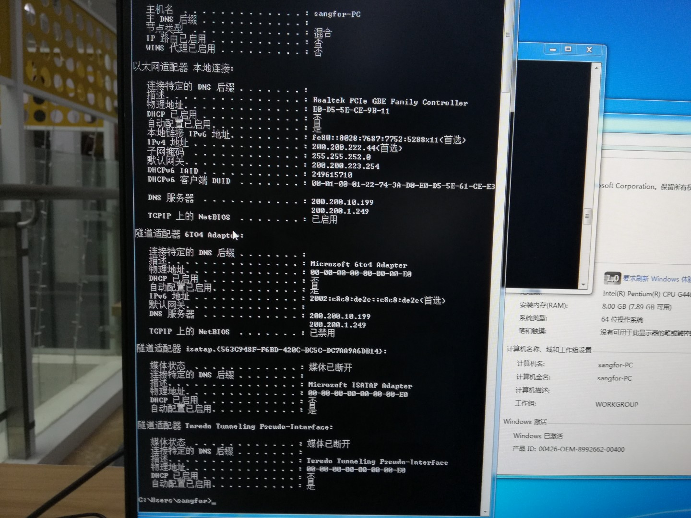

总结下在深信服这两个多月的实习工作经验。
当时和朋友考研结束在网上投简历，结果有天下午接个电话说是深信服HR，电话面试了半个小时，问了些python，数据库索引一类的知识，然后考研成绩出来的那天，看到成绩直接买票去深圳实习，说实话，到了之后我一直在怀疑，我这么菜怎么进来的，里面大佬太多，实习这段时间，说实话各方面都很好，公司包吃住，虽然9106，但是感谢我的导师许衍，他一直帮我解决了很多问题，最后由于各种原因离开，记录下自己的实习经验吧。
---
踩了很多雷，说实话，自己在学校学的不够好，到公司后感觉学习能力不够强，导致对业务的理解不好，因此刚开始那段时间，自己嘴上说每天都是9106，但是自己扪心自问，我的工作效率到底如何，很多时候，效率比时间更重要，不要拿加班的借口搪塞自己，要尽量提高效率少加班。
<!-- more -->
---
1. 明确需求，明确需求，明确需求，充分理解需求，将需求细化，搞清楚查哪张表，需要什么数据，格式是什么，然后再编码，如果需求有疑问直接找产品经理确定。
2. 写代码前，多看下项目的公共接口或方法，优先调用项目公共方法，没有的自己再编码，避免重复造轮子，提高开发效率。
3. 编码前，注意将重复性代码写作公共方法，减少冗余代码量。
4. 对于一个小模块，可以尽量用一个controller，model，dao，form
5. 不要不懂不理解就复制粘贴别人的模块代码，一定要熟悉业务逻辑后，搞清楚之后再调用。
6. 随时都要记得抽象代码，提高代码的复用性
9. 数据库查询时，一定要确定每张表的字段含义，确定要过滤聚合的字段，不要查错字段。
10. 每次定义常量时，先查看每个app的常量里面是否已经有定义，有的话直接使用，不要重复定义，代码中除了，-1,0,1之外，不要出现魔数，对于功能性常量，用const定义在本类中，最好加上注释方便理解。
11. 数据库查询聚合时，一定注意ip type group branch_id唯一确定一台主机。
12. 对于es,mongo查询返回的数据，必须判断每个字段是否可能为空，比如aggragations,buckets,对于buckets这样的数组，用!empty()判断，其他字段用isset()判断该字段是否存在。
13. 中文统一定义到常量里面
14. 表单验证时，不需要默认传参
15. 没有改动代码不要提交到git，常用快捷键格式化代码，代码风格统一
16. 不要循环查数据库,性能太差

## 实习期间的点点滴滴
# 第一天，导师带领下去吃饭，装电脑，配置网络

# 实习时候还带着我婷婷姐之前送我的水杯，超级好用

# 公司大楼

# 秀一波公司的美食O(∩_∩)O哈哈~

# 西丽买的超实惠好吃的潮汕米粉

# 晚上下班，西丽街口跳广场舞的人们

# 在西丽买东西时候看的哦一个好看的小姐姐

# 工卡

# 公司内部交流打卡软件，口袋助理

# 张新兰姐姐哈哈，好可爱n(*≧▽≦*)n

# 实习证明

# 工资

# 公司全家福

# 公司安排的西丽的好美酒店，每天和陶世婷小姐姐一起上下班

# 清明节放假去后海浪

# 写代码

# 去寄快递的陶世婷小姐姐

# 跟陶世婷小姐姐一块回去

# 离职

# 小树姐的工作经验指导

# 南科大，呜呜呜，就在公司旁边，可惜打卡才能进去，只能站在外面看看，难受(╯﹏╰)

# 你知道夜晚11点的南山智园吗

