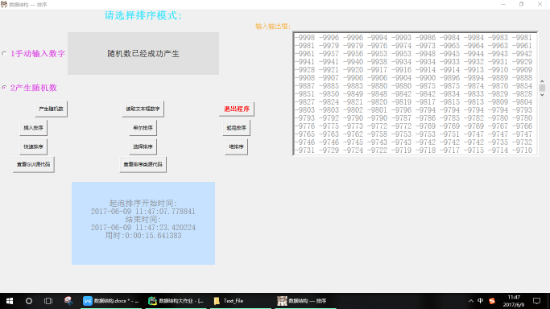
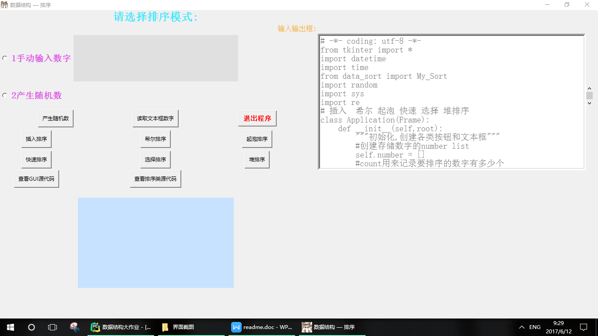

期末数据结构课程，自己用python写了个gui实现界面，用6种排序算法对数组排序，感觉还是挺有意思的，就是折腾tkinter折腾的难受，文档太少了，只能用help看一些内置方法使用
---
界面部分代码
先看下丑到爆的界面QAQ


```python
# -*- coding: utf-8 -*-
from tkinter import *
import datetime
import time
from data_sort import My_Sort
import random
import sys
import re
# 插入  希尔 起泡 快速 选择 堆排序
class Application(Frame):
    def __init__(self,root):
        """初始化,创建各类按钮和文本框"""
        #创建存储数字的number list
        self.number = []
        #count用来记录要排序的数字有多少个
        self.count = 10086
        self.my = My_Sort()
        super(Application,self).__init__(root)
        self.grid()
        self.root = root
        Label(self, text="\t\t").grid(row=0, column=0)
        Label(self, text="请选择排序模式:",
              font = 'STXingkai -25 bold', fg = "#30E6FF").grid(row=0, column=1)
        # 创建单选框，让用户选择数据来源
        self.choose = StringVar()
        self.choose.set(None)
        self.input_number = Radiobutton(self, text="1手动输入数字", variable=self.choose,
                                        value="请在右边对话框里输入随机数，以空格隔开",
                                        command=self.update_text,
                                        justify="center",
                                        font='STXingkai -20 bold', fg="#DF4FE7"
                                        ).grid(row=2, column=0, sticky=W)
        self.rand_number = Radiobutton(self, text="2产生随机数", variable=self.choose,
                                       value = "请点击下面的产生随机数按钮",
                                       command = self.update_text,
                                       justify = "center",
                                       font = 'STXingkai -20 bold', fg="#DF4FE7"
                                       ).grid(row=3, column=0, sticky=W)
        # 创建各个功能的按钮
        self.srand_btn = Button(self, text = "产生随机数",
                                 command = self.create_rand_number
                                 ).grid(row=4, column=0, sticky=E,
                                        ipadx="4p", ipady="4p")
        self.get_txt_btn = Button(self, text="读取文本框数字",
                                command=self.get_Text_number
                                ).grid(row=4, column=1,
                                       ipadx="4p", ipady="4p")
        self.exit_btn = Button(self, text="退出程序", command=self.GuiExit,
                               foreground="red", font='STXingkai -15 bold',
                               ).grid(row=4, column=2, ipadx="4p", ipady="4p")
        self.insert_btn = Button(self, text="插入排序",
                                 command =self.insert
                                 ).grid(row=5, column=0, ipadx="4p", ipady="4p")
        self.shell_btn = Button(self, text="希尔排序",
                                      command = self.shell
                                     ).grid(row=5, column=1, ipadx="4p", ipady="4p")
        self.buddle_btn = Button(self, text="起泡排序",
                                 command = self.buddle
                                 ).grid(row=5, column=2, ipadx="4p", ipady="4p")
        self.quick_btn = Button(self, text="快速排序",
                                command = self.quick
                                ).grid(row=6, column=0, ipadx="4p", ipady="4p")
        self.select_btn = Button(self, text="选择排序",
                                 command = self.select
                                 ).grid(row=6, column=1, ipadx="4p", ipady="4p")
        self.heap_btn = Button(self, text="堆排序",
                               command = self.heap
                               ).grid(row=6, column=2, ipadx="4p", ipady="4p")
        self.view_gui = Button(self, text="查看GUI源代码",command = self.view_gui
                               ).grid(row=7, column=0, ipadx="4p", ipady="4p")
        self.view_sort = Button(self, text="查看排序类源代码",command = self.view_sort
                               ).grid(row = 7, column=1, ipadx="4p", ipady="4p")

        Label(self, text="\t").grid(row=1, column=2)
        Label(self, text="输入输出框:", font='STXingkai -16 ',  fg="#F9A728"
              ).grid(row=1, column=3)
        Label(self,text="").grid(row=8,column=0)
        self.txt = Label(self, text="", width=37, height=5,borderwidth=2,
                         foreground="black",background="#E0E0E0",
                         font='STXingkai -20 ', fg="#4169E1")
        self.txt.grid(row=2, column=1, sticky=W)
        self.efficiency = Label(self, text="",
                                width=35,height=10,borderwidth=2,
                                font='STXingkai -20 ', fg="gray",
                                background="#C6E2FF")
        self.efficiency.grid(row=9, column=1, rowspan=1)
        # 创建输入输出文本框
        self.output_txt = Text(self, width=60, height=15, wrap=WORD,
                               font='STXingkai -20 ', border=5, fg="gray")
        self.output_txt.grid(row=2, column=4, rowspan=5)
        # 创建输出文本框的滚动条
        self.scrollbar = Scrollbar(self)
        self.output_txt.configure(yscrollcommand=self.scrollbar.set)
        self.scrollbar['command'] = self.output_txt.yview
        self.scrollbar.set(0.5, 1)
        self.scrollbar.grid(row=3, column=5)
        self.scrollbar.grid_anchor(E)
    #产生随机数
    def create_rand_number(self):
        if self.choose.get() == "请点击下面的产生随机数按钮":
            for i in range(self.count):
                r = random.randint(-10000,10000)
                self.number.append(r)
            self.txt['text'] = "随机数已经成功产生"
        elif self.choose.get() == "请在右边对话框里输入随机数，以空格隔开":
            self.txt['text'] = "请在右边对话框里输入随机数，以空格隔开"
        else:
            self.txt['text'] = "请选择模式后再进行下一步操作"
    #退出程序
    def GuiExit(self):
        self.quit()
    def update_text(self):
        """更新单选框的值以及文本内容"""
        message = ""
        message += self.choose.get()
        self.txt['text']  = message
        if self.choose.get() == "请在右边对话框里输入随机数，以空格隔开":
            self.get_Text_number()
    #获取输入输出文本框中的数字
    def get_Text_number(self):
        try:
            string = self.output_txt.get(0.0,END)
            list = re.split(' ',string)
            flag = 0
            for i in list :
                num = int(i)
                self.number.append(num)
                flag += 1
            self.count = flag
            self.txt['text'] = "已经成功读完文本框里的数字"
        except:
            pass
    #进行排序
    # 插入排序
    def insert(self):
        if len(self.choose.get()) > 10:
            start = datetime.datetime.now()
            self.number = self.my.insert_sort(self.number)
            end = datetime.datetime.now()
            self.get_effiency_writefile(start,end,name="插入排序",text="insert")
            self.write_number_output()
        else:
            self.txt['text'] = "请先选择排序模式"
    #调用希尔排序
    def shell(self):
        if len(self.choose.get()) > 10:
            start = datetime.datetime.now()
            self.number = self.my.shell_sort(self.number)
            end = datetime.datetime.now()
            self.get_effiency_writefile(start, end, name="希尔排序", text="shell")
            self.write_number_output()
        else:
            self.txt['text'] = "请先选择排序模式"
    #调用起泡排序
    def buddle(self):
        if len(self.choose.get()) > 10:
            start = datetime.datetime.now()
            self.number = self.my.buddle_sort(self.number)
            end = datetime.datetime.now()
            self.get_effiency_writefile(start, end, name="起泡排序", text="buddle")
            self.write_number_output()
        else:
            self.txt['text'] = "请先选择排序模式"
    #调用快速排序
    def quick(self):
        if len(self.choose.get()) > 10:
            start = datetime.datetime.now()
            self.number = self.my.quick_sort(self.number,0,self.count-1)
            end = datetime.datetime.now()
            self.get_effiency_writefile(start, end, name="快速排序", text="quick")
            self.write_number_output()
        else:
            self.txt['text'] = "请先选择排序模式"
    #调用选择排序
    def select(self):
        if len(self.choose.get()) > 10:
            start = datetime.datetime.now()
            self.number = self.my.select_sort(self.number)
            end = datetime.datetime.now()
            self.get_effiency_writefile(start, end, name="选择排序", text="select")
            self.write_number_output()
        else:
            self.txt['text'] = "请先选择排序模式"
    #调用堆排序
    def heap(self):
        if len(self.choose.get()) > 10:
            start = datetime.datetime.now()
            self.number = self.my.heap_sort(self.number)
            end = datetime.datetime.now()
            self.get_effiency_writefile(start, end, name="选择排序", text="heap")
            self.write_number_output()
        else:
            self.txt['text'] = "请先选择排序模式"
    #把排序完成的数字写入输入输出文本框里面
    def write_number_output(self):
        temp = ""
        for i in self.number:
            temp += str(i)
            temp += " "
        self.output_txt.delete(0.0,END)
        self.output_txt.insert(0.0,temp)
    #查看界面类源代码
    def view_gui(self):
        try:
            f = open("Text_File\\gui.txt",'r+')
            txt = f.read()
            self.output_txt.delete(0.0,END)
            self.output_txt.insert(0.0,txt)
        except:
            pass
    #查看排序类源代码
    def view_sort(self):
        try:
            f = open("Text_File\\sort.txt",'r+')
            txt = f.read()
            self.output_txt.delete(0.0,END)
            self.output_txt.insert(0.0,txt)
        except:
            pass
    def get_effiency_writefile(self,start,end,name,text):
        write = name + "开始时间:\n"
        write += str(start)
        write += "\n"
        write += "结束时间:\n"
        write += str(end)
        write += "\n"
        write += "用时:"
        write += str(end-start)
        write +="\n"
        self.efficiency['text'] = write
        try:
            f = open('Text_File\\%s_result.txt' %(text),'w')
            for i in self.number:
                write += str(i)
                write += " "
            f.write(write)
            f.close()
        except:
            pass
if __name__ == '__main__':
    root  = Tk()
    root.title("数据结构 — 排序")
    root.geometry("400x400")
    app = Application(root)
    root.iconbitmap("hanhan.ico")
    root.mainloop()

```
排序代码
---
```python
# -*- coding: utf-8 -*-
import math
import sys
class My_Sort():
    #1插入排序
    def insert_sort(self,lists):
        count = len(lists)
        for i in range(1,count):
            key = lists[i]
            j = i-1
            while j>=0:
                if lists[j] > key:
                    lists[j+1] = lists[j]
                    lists[j] = key
                j-=1
        return lists
    #2希尔排序,python中必须注意，循环中步长为整数
    def shell_sort(self,lists):
        count = int(len(lists))
        step = 2
        group = int(count /step)
        while group >0:
            for i in range(group):
                j = i+group
                while j< count:
                    k = j - group
                    key = lists[j]
                    while(k>=0):
                        if lists[k] >key:
                            lists[k+group] = lists[k]
                            lists[k] = key
                        k -= group
                    j += group
            group = int(group/step)
        return lists
    #3冒泡排序
    def buddle_sort(self,lists):
        count = len(lists)
        for i in range(count):
            for j in range(i+1,count):
                if lists[i] >lists[j]:
                    lists[i],lists[j] = lists[j],lists[i]
        return lists
    #4直接选择排序
    def select_sort(self,lists):
        count = len(lists)
        for i in range(count):
            min = i
            for j in range(i+1,count):
                if lists[min] > lists[j]:
                    min = j
            lists[min],lists[i] = lists[i],lists[min]
        return lists
    #5快速排序
    def quick_sort(self, lists, left, right):
        if left > right:
            return
        i = left
        j = right
        while i != j:
            while lists[j] >= lists[left] and i < j:
                j -= 1
            while lists[i] <= lists[left] and i < j:
                i += 1
            if i < j:
                lists[i], lists[j] = lists[j], lists[i]
        lists[left], lists[i] = lists[i], lists[left]
        self.quick_sort(lists, left, i - 1)
        self.quick_sort(lists, i + 1, right)
        return lists
    #6堆排序
    #调整堆
    def adjust_heap(self,lists,i,size):
        lchild = 2*i+1
        rchild = 2*i+2
        max = i
        if i < int(size/2):
            if lchild < size and lists[lchild] > lists[max]:
                max = lchild
            if rchild < size and lists[rchild] > lists[max]:
                max = rchild
            if max !=i:
                lists[max],lists[i] = lists[i],lists[max]
                self.adjust_heap(lists,max,size)
    # 创建堆
    def build_heap(self,lists,size):
        for i in range(0,int((size/2)))[::-1]:
            self.adjust_heap(lists,i,size)
    #堆排序
    def heap_sort(self,lists):
        size = int(len(lists))
        self.build_heap(lists,size)
        for i in range(0,size)[::-1]:
            lists[0],lists[i] = lists[i], lists[0]
            self.adjust_heap(lists,0,i)
        return lists
      
```
